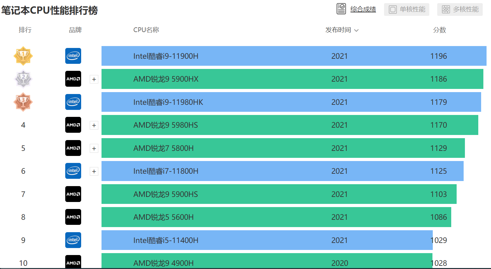
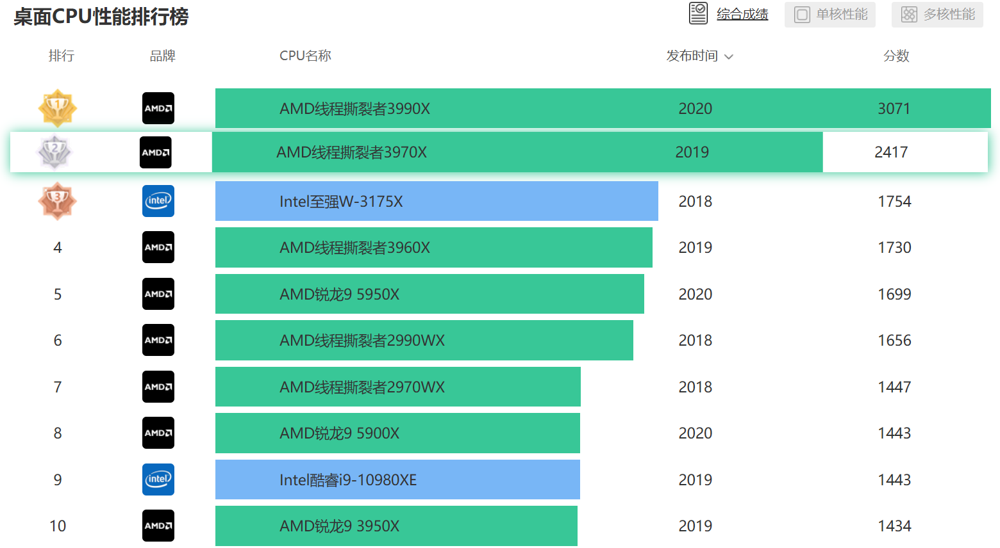
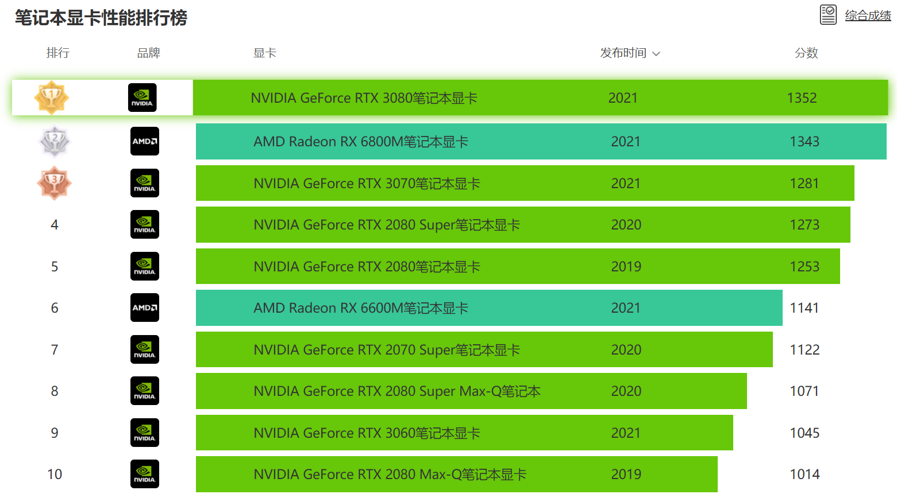

# 个人电脑选购指南💻

你想买一台属于自己的电脑，又不知道如何选择吗？什么品牌？什么配置？预算够吗？这份指南正适合你。对小白如何选择适合自己的电脑，它将提供一些有用的建议。

## 选购原则

**预算和需求**应该是选购电脑要考虑的核心因素。购买电脑围绕自己的预算和需求来选择，才更可能买到最适合自己的电脑。

可能有人会觉得，买个电脑，何必这么大费周章。在你选择一个东西的时候，花一点时间了解下基本情况，再做出行动，应该是做事情的基本前提和要求，是吧？

## 电脑简单分类

个人购买电脑，通常是以便于携带的笔记本为主，在此主要以笔记本来分类，台式机则分为一个类。

### 轻薄本

轻薄本机身轻薄，一般使用低压处理器，无独立显卡或搭载 MX 系列显卡，性能可以满足大多数日常办公、影音娱乐的需要，续航时间较好，可以玩一些对配置要求不高的游戏。

### 游戏本

游戏本是对高性能笔记本的称呼，当然玩游戏肯定更在行。游戏本拥有很高的配置，无论是 CPU 还是显卡，都是上上乘。大型游戏，三维制图渲染软件，统统不在话下，可以说是习武之人必备。

但是缺点也很明显，因为高性能，电脑发热问题就会随之而来，必须配有多风扇和铜管来进行散热，所以这类笔记本一般都比较厚重，续航也不行。

### 全能本

全能本介于轻薄本与游戏本之间，英特尔这两年在推广的一个概念“内容创作本”就属于这个类型。机身不是太厚重，搭载标压处理器和入门级游戏显卡。全能本既可以运行一些轻薄本带不动软件，和玩一些入门级游，但对配置要求较高的一些游戏或软件它就无能为力了。

### 台式机

笔记本最大的优势就是在于便携性，特别适合经常带电脑出行的人群。但如果是定点使用，例如居家使用，台式机是非常棒的选项。

台式机可分为组装机和品牌机。

组装机就是更具自己的需要，购买各个最适合的电脑配件，自己组装的机器；或者是提出自己的各种需求，让商家按你的要求组装的机器。购买组装机需要对电脑硬件及其品牌有较细致的了解，不适合小白选择。

品牌机其实也是品牌商家组装的机器，只是品牌机经过了兼容性，稳定性等测试，获得了工商认证，贴上正规品牌商标，稳定性和售后有保障。

与笔记本相比，台式机的优点有：

- 同价位，台式机性能更高。同价位的笔记本和台式机，台式机在配置上无疑更高，如果是组装机，五六千元的预算组装一台台式机，基本可以通吃市面上的游戏。

- 硬件自由度高，便于升级。台式机在屏幕选择时更舒服、大屏、曲面屏、高清屏，随意选择。台式机更加便于升级，可以升级电脑主机中任何一个硬件，机箱不好看可以更换机箱，散热不好，可以增加机箱风扇，换更好的 CPU 散热器，显卡玩游戏不行，可以更换显卡，内存不够加内存，硬盘存储容量不够，增加硬盘。组装机就外观和配置可以根据自己需求任意定制。而笔记本绝大数只能增加内存和硬盘，核心硬件无法更换，由于笔记本内部空间受限，升级也有所受限。

- 散热更佳。笔记本由于内部空间受限，散热一直是通病，即便有低功耗的硬件，那也是硬件性能换来的。而台式机机箱拥有更大的空间，散热性能更优秀，并且可以增加机箱风扇辅助散热，更换更好的CPU散热器，甚至是组建水冷散热器。

- 维修成本更低。

## 确定预算和需求

确定预算和需求的原则是**两权相较取其重**。也就是：在预算固定时，选择能过够最大限度满足需求的电脑配置；在需求更强和更明确时，在满足需求的同时选择最大性价比。

### 确定合适的预算

下面的预算分级是以笔记本为标准。预算不够，对电脑配置要求又较高，如果没有笔记本的便携性需求，购买同等价位的台式机是不错的选项。

预算的简单分级：

- 2000-4000，这个价位的笔记本电脑一般可以满足简单的日常办公和影音娱乐，对于没有任何特殊需求的来讲，可以选择这个预算。

- 4000-7000，这个是目前大多数购买笔记本电脑的用户选择的预算范围，这个价位的笔记本电脑是各厂商相互竞争主战场，性价比极高的机器层出不穷。

- 7000-10000，这个预算范围的笔记本，玩游戏可以保证市面上大多数游戏非常流畅的运行，各类大型软件也可以比较流畅地使用，也能满足应用多开的复杂办公需求等。

- 万元以上，这是一个追求满足使用需求外，对于笔记本电脑做工，品牌，外观有更高要求，或者对笔记本有更特殊的配置要求的一个预算范围。

### 确定正确的需求

市面上个人电脑基本都是预装 Windows 系统或 Mac OS 系统（苹果电脑专属），因此确定购买 Windows 系统的电脑还是购买苹果电脑，也是必须明确的需求。

两种系统对比：

#### window系统

- 窗口化的操作，所见即所得，傻瓜式配置方式。

- 系统不够稳定，蓝屏、死机是常事。

- 系统兼容性比较好，各种软件很多，各种问题都能很容易找到解决方案。

- 系统会随着使用时间越来越臃肿，系统垃圾越来越多，系统运行越来越慢。

- 病毒和广告的骚扰非常让人讨厌。

#### Mac OS 系统

- 系统非常稳定，无病毒之忧心，无广告之烦神。

- 操作便捷性更胜一筹，特别是安装诸如 Alfred、Paste 等神器后，很爽。

- 电池续航时间长。

- 适合影音艺术设计领域，包含平面设计、视频剪辑、开发工具，还有音频、特效等。

- 适合计算机编程。

- 对玩游戏的支持不太好。

- 某些专用软件缺少 Mac 版本，有些工作上的专用软件需要在 Windows 虚拟机中去运行。

- 使用者相对小众，遇到问题寻找解决方案麻烦一些。

#### 明确使用领域和复杂程度

如果只简单编程学习，office 日常办公，日常影音娱乐，小型游戏等简单需求，轻薄本或全能本即可满足。

机械制造，建筑设计，环艺设计等常用到 3D 类制图建模类软件的领域；编导，传媒，人工智能等领域；应用多开的复杂办公场景以及玩大型游戏，推荐高性能全能本，台式机或入门级游戏本起步。

**注意**：在选择电脑前，最好查看或咨询需要使用到的相关软件对电脑配置的要求，按照软件最低配置要求以上来选择。

## 电脑硬件简介

购买电脑要关注的主要核心部件有：CPU，显卡，内存，硬盘，显示屏。

这个网站可以查看 CPU 和显卡性能排行榜：https://rank.kkj.cn/mcpu.shtml

### CPU

CPU 是电脑的核心部分，就如同人的大脑。生产厂家主要是英特尔 (Intel) 和 AMD。

就笔记本而言，Intel 主要四个酷睿系列 i3，i5，i7 和 i9；AMD 主要四个锐龙系列 R3，R5，R7 和 R9，从前往后分别代表低端，中端，中高端，高端。

笔记本 CPU 性能排行前十：

参数简单举例说明：

>Intel酷睿i9-11900H

- i9 如上所述代表高端 i9 系列；11 代表第十一代；900 代表级别，同一系列相同参数下该数字越大，性能越高，例如 `Intel酷睿i7-10875H` > `Intel酷睿i7-10870H`。

>AMD锐龙7 5800U

- 7 如上所述代表中高端 R7 系列；5 代表第五代；800 代表级别，同一系列相同参数下该数字越大，性能越高，例如 `AMD锐龙7 5800U` > `AMD锐龙7 5700U`。

- 一般数字越高的系列，性能越好，但因为代数的高低，会有相反的情况，例如 `AMD锐龙7 5800H`(R7第五代) > `AMD锐龙9 4900H`(R9第四代)

- 后缀字母简单说明：`U` 代表超低功耗（Ultra-low power），也叫做低压，就是牺牲一点性能，尽量降低功耗。一般用于轻薄本、追求长续航的商务本；`H` 代表高性能（High performance），也叫做标压。一般用于高性能笔记本或游戏本。

台式机 CPU 性能排行前十：

### 显卡

我们看到的电脑里精美的画面，都是由显卡渲染输出的。性能好的显卡能够使我们通过显示器看到的画面就更加流畅，更加清晰。所以显卡的上限决定了电脑画面的质量。

就笔记本而言，市场上显卡也分两家，N 卡和 A 卡。N 卡就是搭载 NVIDIA（英伟达）芯片的显卡，而 A 卡就是搭载 AMD 芯片的显卡。主流都用 N 卡。

笔记本显卡性能排行前十：

台式机显卡性能排行前十：

型号参数所代表的含义，与上述 CPU 参数类似，不在累述。

此外，显卡还还分为集成显卡和独立显卡，简称集显和独显。集显不可升级，功耗低，发热量少，但是性能低，一般用在简单办公、追求续航的低预算笔记本上。独显可以升级，性能优秀，但是功耗高，发热量大，也贵。对电脑性能要求较高的应用需求，选择独显。

### 内存

我们把系统启动，打开软件，访问网页等计算机运行所临时占用的存储空间，叫内存。系统启动项越多，打开的软件越多，或越大型，占用内存越高。现在的计算机系统启动基本就占用了 2 ~ 3g 的内存，因此根据预算和需求，内存选择越高越好。

一般来讲轻薄本，全能本的内存是焊接在主板上的，因此大多数轻薄本是不可以自己再加内存的。游戏本，高性能笔记本一般是留有内存插槽可以自行增加内存。

日常笔记本电脑建议 8g 起步，玩游戏或者多开软件建议加内存到 16G，这样切换软件或者多开会比较流畅。两条 8G 内存可以构成双通道， 双通道游戏帧数稳定性提升比较明显。

### 硬盘

硬盘分为机械硬盘和固态硬盘（SSD）。固态硬盘读写速度比机械硬盘快数十倍甚至上百倍。

硬盘容量决定了你可以在自己的电脑上存多少文件、照片和视频。

硬盘读写速度决定了开机关机，载入软件等电脑整体使用的流畅度，所以建议选择固态硬盘。

如果购买固态轻薄本，注意硬盘是否可更换或扩容，如果不能，建议购买一步到位，否则硬盘满了就只能转移或删东西了。容量上办公用的轻薄本一般 512G 固态硬盘足够使用。游戏本，高性能笔记本电脑一般留有固态位置，可以自行增加。但增加时注意接口和协议是否相匹配。

### 显示屏

屏幕有材质、尺寸、分辨率、刷新率、色域等参数，简单介绍如下：

- 材质分为 IPS 和 TN 屏。现在基本上都选择 IPS 材质；

- 尺寸有 13 英寸，14 英寸，15.6 英寸等，一般来说大屏性能好，但会重一点。

- 分辨率基本上最低也是 1920X1080 分辨率，也叫做 1080P。

- 刷新率。所谓屏幕刷新率是指每秒钟电脑屏幕能够刷新画面的数量，刷新率越高，我们看的视频也就越流畅，画面质量也越好，单位是 HZ。刷新率低更省电，如果不要求省电，越高越好。有些电脑可以切换刷新率。

- 色域。屏幕色域是指你能看的颜色范围，色域越广，笔记本电脑屏幕显示出的颜色越精准。低预算，选择标称 45%NTSC 色域；常规需求选择 72%NTSC 或 100%sRGB 色域；有设计等专业需求，选择 100%Adobe RGB 色域。

## 选购时考虑的其他参数

购买电脑可能还需要考虑的参数还有：笔记本电脑的电池容量和续航；需要用到的接口是否都有，例如耳机，usb 等（无特殊要求一般都满足）；键盘和鼠标等。

## 购买渠道

购买渠道推荐官方网站或网购平台上的官方旗舰店，品质和售后都有保障。对小白来说，实体店可以去体验一下喜欢的电脑，手感，外观等是否满意。再在官方查看一下相同型号的价格，切不可被忽悠了就马上下单。

正规渠道也可以货比三家，不同平台上可能促销活动等不一，价格有一定波动。

好了。祝您买到心仪的电脑！